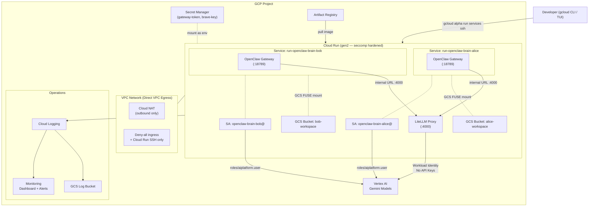
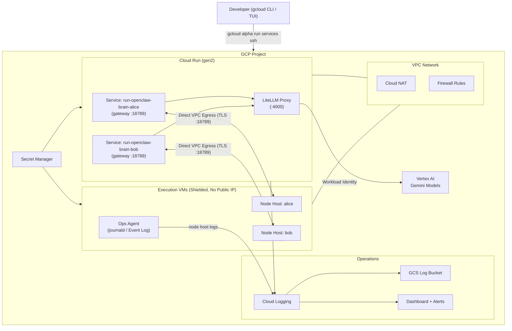
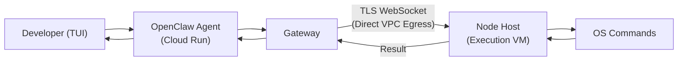
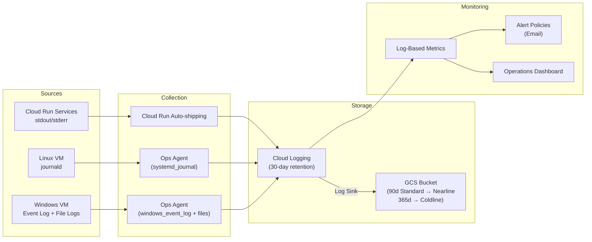

# OpenClaw on GCP — Cloud Run with MicroVM Sandbox Isolation

Deploy [OpenClaw](https://docs.openclaw.ai) on Google Cloud using **Cloud Run** with MicroVM sandbox isolation (2nd-generation execution environment), GCS FUSE workspace mounts, Direct VPC Egress, and Vertex AI — fully managed by Terraform. Each developer gets an isolated Cloud Run service, GCS bucket, and service account. Optionally add execution VMs (Windows/Linux) for OS-native command execution.

---

## Table of Contents

- [Architecture](#architecture)
- [Execution Environment Options](#execution-environment-options)
- [Security Features](#security-features)
- [Deployment Guide](#deployment-guide)
- [End-to-End Testing](#end-to-end-testing)
- [Adding Messaging Channels](#adding-messaging-channels)
  - [Telegram](#telegram)
- [Execution VM (Optional)](#execution-vm-optional)
- [Windows VM Golden Image](#windows-vm-golden-image)
- [Observability](#observability)
- [Variables Reference](#variables-reference)
- [Outputs Reference](#outputs-reference)
- [File Structure](#file-structure)
- [Troubleshooting](#troubleshooting)
- [Cleanup](#cleanup)

---

## Architecture

[Back to top](#table-of-contents)

### Default: Cloud Run Only (no execution VM)



### With Execution VM (`exec_vms` non-empty)



### Component Overview

| Component | Purpose |
|-----------|---------| 
| **Cloud Run (gen2)** | Fully-managed, serverless containers with seccomp syscall filtering for sandbox-level isolation — no cluster management |
| **Direct VPC Egress** | Cloud Run services egress directly into the VPC subnet — enabling private VM connectivity without a serverless VPC connector |
| **LiteLLM Proxy** | Routes LLM requests to Vertex AI Gemini models via Workload Identity — no API keys |
| **Per-Developer Service Accounts** | Each developer's Cloud Run service runs under its own GCP SA — strict IAM isolation between developers |
| **Per-Developer GCS Workspaces** | Each developer gets a dedicated GCS bucket mounted via GCS FUSE — isolated, persistent across revisions |
| **Execution VM** *(optional)* | Windows or Linux VM for OS-native command execution (PowerShell, CMD, bash) |
| **Node Hosts** *(optional)* | Per-developer `openclaw node run` processes on VMs, connecting to Cloud Run services over TLS WebSocket |
| **Cloud Monitoring** | Dashboard with 7 tiles, alert policies for crashes, disconnections, and exec denials |
| **Cloud Logging** | Logs routed to GCS with lifecycle policies (90d Nearline, 365d Coldline) |


[Back to top](#table-of-contents)

---

## Execution Environment Options

[Back to top](#table-of-contents)

Cloud Run supports two execution environments, selectable via `execution_environment`. Both run the same container image — no cluster or node changes required:

| | `gen2` (default) | `gen1` |
|---|---|---|
| **Sandbox** | MicroVM (recommended) | gVisor |
| **Isolation** | seccomp syscall filtering + Sandbox2 Linux namespace isolation | User-space kernel (syscall interception via `runsc`) |
| **Compatibility** | Best — supports GCS FUSE, broader syscall surface | Good — some syscalls unsupported |
| **Cold start** | Slightly higher | Lower |
| **Switching** | Change `execution_environment` variable + redeploy | Same |

### Choosing an Environment

**Use `gen2`** (default) — recommended for compatibility. GCS FUSE requires gen2. Best choice unless you have a specific reason to use gen1.

**Use `gen1`** only if you experience gen2 compatibility issues (e.g., specific syscall requirements).

### Configuring the Environment

In `terraform.tfvars`:

```hcl
# Option 1: MicroVM sandbox — gen2 (default, recommended)
execution_environment = "gen2"

# Option 2: gVisor — gen1
execution_environment = "gen1"
```

Changing `execution_environment` triggers a Cloud Run service revision — no downtime, traffic shifts automatically.

[Back to top](#table-of-contents)

---

## Security Features

[Back to top](#table-of-contents)

### Sandbox Isolation

Every OpenClaw brain service runs inside a Cloud Run sandbox — gen2 (MicroVM, default) or gen1 (gVisor) — set via `execution_environment`.

#### gen2 — MicroVM Sandbox (default)

- **seccomp syscall filtering** — Limits the syscalls available to the container.
- **Sandbox2 Linux namespace isolation** — Additional namespace-level isolation beyond standard containers.
- **GCS FUSE support** — Required for workspace bucket mounts.
- **Recommended** for best compatibility and isolation.

#### gen1 — gVisor

- **User-space kernel** — `runsc` intercepts Linux syscalls before they reach the host kernel.
- **Lower cold-start overhead** — No MicroVM boot sequence.
- Use when gen2 causes compatibility issues.

### Zero API Keys

The authentication chain uses identity federation — no API key secrets exist:

```
Cloud Run Service → GCP Service Account → Vertex AI
```

- LiteLLM uses Application Default Credentials via the metadata server.
- Each developer's service has its own dedicated service account — no shared identity.
- Tokens are automatically refreshed — no key rotation needed.
- The only secrets stored are the gateway auth token (auto-generated) and optional Brave API key.

### Network Isolation

| Control | Implementation |
|---------|---------------|
| Direct VPC Egress | All Outbound traffic routed through private VPC subnet |
| Cloud NAT | Outbound-only internet for image pulls and Vertex AI |
| Deny-all ingress firewall | Only IAP SSH (`35.235.240.0/20`) and exec-VM-to-service allowed |
| Per-developer GCS isolation | Each developer's workspace is a separate GCS bucket; cross-access not granted |
| Per-developer SA | Each service has its own SA — compromise of one does not affect others |

### IAM Least Privilege

| Service Account | Roles | Purpose |
|----------------|-------|---------|
| `run-openclaw-brain-{dev}` | `aiplatform.user`, `logging.logWriter`, `monitoring.metricWriter`, `storage.objectAdmin` (own bucket only), `secretmanager.secretAccessor` | Per-developer Cloud Run SA |
| `run-openclaw-exec-vm` | `logging.logWriter`, `monitoring.metricWriter` | VM log/metric shipping |
| `run-openclaw-cloudbuild` | `artifactregistry.writer`, `storage.objectAdmin`, `logging.logWriter` | Cloud Build image push |

### Application Security

| Layer | Protection |
|-------|-----------|
| **TLS + fingerprint pinning** | Self-signed ECDSA P256 cert, SHA256 fingerprint validated by node hosts |
| **Token authentication** | All WebSocket connections require `OPENCLAW_GATEWAY_TOKEN` from Secret Manager |
| **Non-root containers** | UID 10001, non-root enforced in Dockerfile |
| **Container scanning** | `containerscanning.googleapis.com` enabled on Artifact Registry |
| **Pinned LiteLLM image** | SHA256 digest, not mutable tag |
| **max-instances = 1** | Each developer service capped at 1 instance — no horizontal scaling of sessions |

### Device Auth Design Decision

This deployment sets `dangerouslyDisableDeviceAuth: true` — a deliberate choice for headless/server deployments, **not** a security oversight.

**Why:** With device auth enabled, every WebSocket connection requires interactive pairing approval. In a headless Cloud Run deployment there is no UI to approve the first operator pairing — creating a chicken-and-egg problem.

**Why it is still secure:** All connections require the gateway auth token from Secret Manager. VPC firewall rules restrict access. For channel-level access control (e.g., Telegram), use `dmPolicy: "pairing"` on each channel.

> **Warning:** Never set `dangerouslyDisableDeviceAuth: false` in headless deployments — it will permanently lock out all connections if pairing data is lost.

[Back to top](#table-of-contents)

---

## Deployment Guide

[Back to top](#table-of-contents)

### Prerequisites

- [Terraform](https://developer.hashicorp.com/terraform/install) >= 1.5
- [gcloud CLI](https://cloud.google.com/sdk/docs/install) authenticated with a project owner account
- A GCP project with billing enabled
- `gcloud components install alpha` (for Cloud Run SSH)

### Step 1: Project Org Policies

No org policy changes are required for Cloud Run.

### Step 2: Create the State Bucket

```bash
export PROJECT_ID="my-gcp-project"
export TF_STATE_BUCKET_REGION="asia-southeast1"

gsutil mb -p "$PROJECT_ID" -l $TF_STATE_BUCKET_REGION "gs://${PROJECT_ID}-openclaw-run-tf-state"
gsutil versioning set on "gs://${PROJECT_ID}-openclaw-run-tf-state"
```

[Back to top](#table-of-contents)

### Step 3: Clone and Configure

```bash
git clone https://github.com/t2tse/openclaw-cloudrun.git
cd openclaw-cloudrun
```

Copy `terraform.tfvars.example` to `terraform.tfvars` and edit:

```hcl
# Required
project_id = "my-gcp-project"

# Target Region & Zone to deploy
region = "us-central1"
zone   = "us-central1-c"

# Developers / OpenClaw Users -- each gets an isolated OpenClaw service + GCS bucket
developers = {
  "alice" = { active = true }
  "bob"   = { active = true }
}

# OpenClaw
openclaw_version = "latest"
model_primary    = "litellm/gemini-3.1-pro-preview"
model_fallbacks  = "[\"litellm/gemini-3.1-flash-lite-preview\"]"

# Execution environment -- choose one:
#   "gen2" -- MicroVM sandbox (default, recommended; required for GCS FUSE)
#   "gen1" -- gVisor (user-space kernel)
execution_environment = "gen2"

# Optional: Execution VMs (uncomment to enable)
# exec_vms = {
#   "windows" = { os_image = "windows-cloud/windows-2022-core" }
#   "linux"   = { os_image = "debian-cloud/debian-12" }
# }

# Alerts (optional)
alert_email = "you@example.com"
```

Set sensitive variables via environment:

```bash
export TF_VAR_gateway_auth_token=""  # leave empty to auto-generate
export TF_VAR_brave_api_key=""       # optional
```

[Back to top](#table-of-contents)

### Step 4: Deploy

```bash
terraform init -backend-config="bucket=${PROJECT_ID}-openclaw-run-tf-state"
terraform plan
terraform apply
```

This will:
1. Enable all required GCP APIs
2. Create VPC (`openclaw-run-vpc`), subnet, Cloud NAT, firewall rules
3. Create Artifact Registry repository and build the OpenClaw image via Cloud Build
4. Create per-developer GCS workspace buckets
5. Create per-developer service accounts with least-privilege IAM bindings
6. Create the LiteLLM service account with Vertex AI and logging access
7. Store secrets in Secret Manager (gateway token, LiteLLM key, optional Brave API key)
8. Set up monitoring dashboard, alert policies, and log sink
9. *(If `exec_vms` is non-empty)* Create execution VMs, subnet, firewall, and startup scripts

> **Note:** Cloud Run services are deployed separately in **Step 5** using `gcloud run deploy`.

Deployment takes approximately 8–12 minutes (Cloud Build image build is the bottleneck).

> **Note:** If Cloud Build fails with a 403 on first run (IAM propagation race), run `terraform apply` again.

[Back to top](#table-of-contents)

### Step 5 (Optional): Build and Push a Custom Container Image

> **This step can be skipped** by default it uses the openclaw image built in the project Artifact Registry

> **Only run this step** if you customise the image Dockerfile and want to redeploy.
```bash
export PROJECT_ID="my-gcp-project"
export REGION="us-central1"
./scripts/build_and_push.sh
```

[Back to top](#table-of-contents)

### Step 6: Deploy Cloud Run Services

Terraform creates all supporting infrastructure (VPC, IAM, secrets, GCS buckets, Artifact Registry, and the container image via Cloud Build). The Cloud Run services themselves are deployed with `gcloud run deploy`.

```bash
export PROJECT_ID="my-gcp-project"
export REGION="us-central1"

# Resolve names from Terraform state
export SUBNET=$(terraform output -raw cloudrun_subnet)
export NAME_PREFIX=$(terraform output -raw name_prefix)  # match name_prefix in terraform.tfvars
export AR_REPO="${REGION}-docker.pkg.dev/${PROJECT_ID}/${NAME_PREFIX}-openclaw-sandbox"
export GHCR_REMOTE_REPO="${REGION}-docker.pkg.dev/${PROJECT_ID}/${NAME_PREFIX}-ghcr-remote"
export GATEWAY_SECRET="${NAME_PREFIX}-openclaw-gateway-token"
export LITELLM_KEY_SECRET="${NAME_PREFIX}-openclaw-litellm-key"
```

#### 6a: Deploy the LiteLLM Proxy

Deploy the shared LiteLLM proxy first — brain services need its URL as an environment variable.

```bash
gcloud run deploy ${NAME_PREFIX}-openclaw-litellm \
  --image "${GHCR_REMOTE_REPO}/berriai/litellm@sha256:7c311546c25e7bb6e8cafede9fcd3d0d622ac636b5c9418befaa32e85dfb0186" \
  --region $REGION --project $PROJECT_ID \
  --service-account ${NAME_PREFIX}-openclaw-litellm@${PROJECT_ID}.iam.gserviceaccount.com \
  --execution-environment gen2 \
  --no-allow-unauthenticated \
  --ingress internal \
  --vpc-egress all-traffic \
  --network openclaw-run-vpc \
  --subnet $SUBNET \
  --scaling 1 \
  --memory 512Mi --cpu 1 \
  --set-secrets LITELLM_MASTER_KEY=${LITELLM_KEY_SECRET}:latest

# Capture the service URL for use in brain service deployments
export LITELLM_URL=$(gcloud run services describe ${NAME_PREFIX}-openclaw-litellm \
  --region $REGION --project $PROJECT_ID \
  --format='value(status.url)')
```

#### 6b: Deploy Per-Developer Brain Services

Repeat for each developer defined in `terraform.tfvars`. The example below uses `alice` — replace with each developer name.

```bash
DEVELOPER="alice"

gcloud run deploy ${NAME_PREFIX}-openclaw-brain-${DEVELOPER} \
  --image "${AR_REPO}/openclaw:latest" \
  --region $REGION --project $PROJECT_ID \
  --service-account ${NAME_PREFIX}-openclaw-brain-${DEVELOPER}@${PROJECT_ID}.iam.gserviceaccount.com \
  --execution-environment gen2 \
  --no-allow-unauthenticated \
  --vpc-egress all-traffic \
  --network openclaw-run-vpc \
  --subnet $SUBNET \
  --scaling 1 \
  --no-cpu-throttling \
  --memory 2Gi --cpu 2 \
  --set-secrets GATEWAY_AUTH_TOKEN=${GATEWAY_SECRET}:latest,LITELLM_MASTER_KEY=${LITELLM_KEY_SECRET}:latest \
  --add-volume name=workspace,type=cloud-storage,bucket=${PROJECT_ID}-${NAME_PREFIX}-openclaw-workspace-${DEVELOPER} \
  --add-volume-mount volume=workspace,mount-path=/app/workspace \
  --set-env-vars "DEVELOPER=${DEVELOPER},VERTEXAI_PROJECT=${PROJECT_ID},LITELLM_BASE_URL=${LITELLM_URL}/v1"
```

> **Multiple developers:** Wrap the deploy in a loop:
> ```bash
> for DEVELOPER in alice bob; do
>   gcloud run deploy ${NAME_PREFIX}-openclaw-brain-${DEVELOPER} \
>     --image "${AR_REPO}/openclaw:latest" \
>     --region $REGION --project $PROJECT_ID \
>     --service-account ${NAME_PREFIX}-openclaw-brain-${DEVELOPER}@${PROJECT_ID}.iam.gserviceaccount.com \
>     --execution-environment gen2 \
>     --no-allow-unauthenticated \
>     --vpc-egress all-traffic \
>     --network openclaw-run-vpc \
>     --subnet $SUBNET \
>     --scaling 1 \
>     --no-cpu-throttling \
>     --memory 2Gi --cpu 2 \
>     --set-secrets GATEWAY_AUTH_TOKEN=${GATEWAY_SECRET}:latest,LITELLM_MASTER_KEY=${LITELLM_KEY_SECRET}:latest \
>     --add-volume name=workspace,type=cloud-storage,bucket=${PROJECT_ID}-${NAME_PREFIX}-openclaw-workspace-${DEVELOPER} \
>     --add-volume-mount volume=workspace,mount-path=/app/workspace \
>     --set-env-vars "DEVELOPER=${DEVELOPER},VERTEXAI_PROJECT=${PROJECT_ID},LITELLM_BASE_URL=${LITELLM_URL}/v1"
> done
> ```

[Back to top](#table-of-contents)

### Step 7: Verify

```bash
export PROJECT_ID="my-gcp-project"
export REGION="us-central1"

# List Cloud Run services
gcloud run services list --project $PROJECT_ID --region $REGION

# Expected:
# SERVICE                     REGION       URL
# run-openclaw-brain-alice    us-central1  https://run-openclaw-brain-alice-...
# run-openclaw-brain-bob      us-central1  https://run-openclaw-brain-bob-...
# run-litellm                 us-central1  https://run-litellm-...

# Verify execution environment
gcloud run services describe run-openclaw-brain-alice \
  --region $REGION --project $PROJECT_ID \
  --format='value(spec.template.metadata.annotations[run.googleapis.com/execution-environment])'
# Expected: gen2

# SSH into the container and verify non-root user
gcloud alpha run services ssh run-openclaw-brain-alice \
  --region $REGION --project $PROJECT_ID <<< 'id'
# Expected: uid=10001(openclaw) gid=10001(openclaw)

# Verify GCS FUSE workspace mount
gcloud alpha run services ssh run-openclaw-brain-alice \
  --region $REGION --project $PROJECT_ID <<< 'ls /app/workspace'
```

[Back to top](#table-of-contents)

### Step 8: Approve Node Host Pairing (only if `exec_vms` is non-empty)

Wait 3–5 minutes for the VM startup script to install OpenClaw and start node hosts. Each node host will attempt to connect to its developer's gateway pod and request pairing approval.

> **Automatic Pairing (New):** When `exec_vms` is non-empty, a background loop automatically approves pending node host pairing requests every 60 seconds. This loop is **automatically disabled** when no execution VMs are deployed to avoid event loop blocking. Manual approval via TUI/CLI is still supported if you prefer manual control.

#### Option A: Approve via TUI

```bash
# SSH into alice's Cloud Run service and launch the TUI
gcloud alpha run services ssh run-openclaw-brain-alice \
  --region $REGION --project $PROJECT_ID <<< 'npx openclaw tui'
```

Once in the TUI, you will see a pairing request notification. Type the approval command shown (e.g., `/approve <request-id> allow`).

#### Option B: Approve via CLI

```bash
# List pending pairing requests
gcloud alpha run services ssh run-openclaw-brain-alice \
  --region $REGION --project $PROJECT_ID <<< 'npx openclaw nodes pending'

# Approve a pending request by ID
gcloud alpha run services ssh run-openclaw-brain-alice \
  --region $REGION --project $PROJECT_ID <<< 'npx openclaw nodes approve <REQUEST_ID>'
```

> **Tip:** The node host retries every 10 seconds. If `nodes pending` shows no requests, wait a moment and try again — the request may appear briefly between retries.

#### Verify Connection

```bash
# Check alice's nodes
gcloud alpha run services ssh run-openclaw-brain-alice \
  --region $REGION --project $PROJECT_ID <<< 'npx openclaw nodes status'
# Expected: linux-alice and/or windows-alice showing "paired · connected"

# Check bob
gcloud alpha run services ssh run-openclaw-brain-bob \
  --region $REGION --project $PROJECT_ID <<< 'npx openclaw nodes status'
```

[Back to top](#table-of-contents)

---

## End-to-End Testing

[Back to top](#table-of-contents)

Step-by-step guide to verify every feature after deployment.

### Prerequisites

```bash
export PROJECT_ID="my-gcp-project"
export REGION="us-central1"

# Verify services are running
gcloud run services list --project $PROJECT_ID --region $REGION
# Expected: run-openclaw-brain-alice, run-openclaw-brain-bob, run-litellm in READY state
```

[Back to top](#table-of-contents)

### Test 1: LiteLLM Proxy Health

```bash
# liveness check
gcloud alpha run services ssh run-litellm \
  --region $REGION --project $PROJECT_ID \
  <<< "node -e \"fetch('http://localhost:4000/health/liveness').then(r => r.text()).then(console.log)\""

# readiness check
gcloud alpha run services ssh run-litellm \
  --region $REGION --project $PROJECT_ID \
  <<< "node -e \"fetch('http://localhost:4000/health/readiness').then(r => r.json()).then(console.log)\""
```

Expected: `{"status":"ok"}`

[Back to top](#table-of-contents)

### Test 2: Sandbox / Execution Environment Verification

```bash
# Verify execution environment annotation
gcloud run services describe run-openclaw-brain-alice \
  --region $REGION --project $PROJECT_ID \
  --format='value(spec.template.metadata.annotations[run.googleapis.com/execution-environment])'
# Expected: gen2

# Verify kernel isolation (dmesg should be blocked by seccomp in gen2)
gcloud alpha run services ssh run-openclaw-brain-alice \
  --region $REGION --project $PROJECT_ID <<< 'dmesg 2>&1 | head -5'
# Expected: "dmesg: read kernel buffer failed: Operation not permitted"
```

[Back to top](#table-of-contents)

### Test 3: OpenClaw TUI (Interactive)

```bash
# Launch the TUI inside alice's Cloud Run service
gcloud alpha run services ssh run-openclaw-brain-alice \
  --region $REGION --project $PROJECT_ID <<< 'npx openclaw tui'
```

In the TUI:

1. **Test basic conversation:**
   ```
   You: Hello, what model are you using?
   ```
   Verify the agent responds and identifies the Gemini model.

2. **Test command execution** (requires execution VM):
   ```
   You: Run "hostname" on the Windows node host
   ```
   Approve the command when the approval box appears:
   ```
   ┌─ exec ──────────────────────────────
   │ hostname
   │ host: windows-alice
   │ id: a1b2c3
   │ ─────────────────────────────────
   │ /approve a1b2c3 allow
   └─────────────────────────────────────
   ```
   Type `/approve a1b2c3 allow` (replace with the actual id shown).

3. **Exit:** Press `Ctrl+C` or type `/exit`

[Back to top](#table-of-contents)

### Test 4: Node Invoke (Non-Interactive)

```bash
# Get alice's connected node ID
ALICE_NODE=$(gcloud alpha run services ssh run-openclaw-brain-alice \
  --region $REGION --project $PROJECT_ID \
  <<< 'npx openclaw nodes status --json 2>/dev/null' | jq -r '.nodes[] | select(.connected) | .id')

# Invoke a system command
gcloud alpha run services ssh run-openclaw-brain-alice \
  --region $REGION --project $PROJECT_ID \
  <<< "npx openclaw nodes invoke --node \"$ALICE_NODE\" --command system.which --params '{\"bins\":[\"cmd\",\"powershell\",\"node\"]}'"

# Expected: {"ok":true, "payload":{"bins":{"cmd":"C:\\Windows\\system32\\cmd.exe",...}}}
```

[Back to top](#table-of-contents)

### Test 5: Multi-Developer Isolation

```bash
# Write a file to alice's GCS workspace
gcloud alpha run services ssh run-openclaw-brain-alice \
  --region $REGION --project $PROJECT_ID <<< 'echo "alice-private" > /tmp/secret.txt'

# Verify bob cannot see it (separate GCS bucket)
gcloud alpha run services ssh run-openclaw-brain-bob \
  --region $REGION --project $PROJECT_ID <<< 'cat /tmp/secret.txt 2>&1'
# Expected: "No such file or directory"

# Verify alice can still read it
gcloud alpha run services ssh run-openclaw-brain-alice \
  --region $REGION --project $PROJECT_ID <<< 'cat /tmp/secret.txt'
# Expected: "alice-private"
```

[Back to top](#table-of-contents)

### Test 6: GCS FUSE Workspace Persistence

```bash
# Write a marker file to alice's GCS FUSE workspace
gcloud alpha run services ssh run-openclaw-brain-alice \
  --region $REGION --project $PROJECT_ID <<< 'echo "persist-test" > /app/workspace/marker.txt'

# Deploy a new revision (simulates a container restart)
gcloud run services update run-openclaw-brain-alice \
  --region $REGION --project $PROJECT_ID \
  --update-env-vars RESTART_MARKER=$(date +%s)

# Verify the file survived (GCS FUSE persists across revisions)
gcloud alpha run services ssh run-openclaw-brain-alice \
  --region $REGION --project $PROJECT_ID <<< 'cat /app/workspace/marker.txt'
# Expected: "persist-test"
```

[Back to top](#table-of-contents)

### Test 7: Logging Pipeline

```bash
# Check logs are flowing to Cloud Logging
gcloud logging read \
  'resource.type="cloud_run_revision" AND resource.labels.service_name=~"run-openclaw-brain"' \
  --project=$PROJECT_ID --limit=5 --format='value(textPayload)'

# Verify log sink exists
gcloud logging sinks list --project=$PROJECT_ID

# Verify alert policies
gcloud alpha monitoring policies list --project=$PROJECT_ID \
  --format='table(displayName,enabled)'
```

Expected:
- Recent log entries from OpenClaw Cloud Run services
- Log sink pointing to a GCS bucket
- Alert policies for CrashLoop, Node Disconnected, Exec Denied, and VM Node Host Failure

[Back to top](#table-of-contents)

### Test 8: Outbound Network Access

```bash
gcloud alpha run services ssh run-openclaw-brain-alice \
  --region $REGION --project $PROJECT_ID \
  <<< "node -e \"fetch('https://www.google.com').then(r => console.log(r.status))\""
# Expected: 200 (Cloud NAT provides outbound access via Direct VPC Egress)
```

[Back to top](#table-of-contents)

---

## Adding Messaging Channels

[Back to top](#table-of-contents)

OpenClaw supports 20+ channels including Telegram, WhatsApp, Slack, Discord, Signal, Google Chat, Microsoft Teams, and more. Channels are configured via **CLI commands** or the **Control UI** — no SSH or VM access required.

### Telegram

[Back to top](#table-of-contents)

#### 1. Create a Telegram Bot

1. Open Telegram and message [@BotFather](https://t.me/BotFather)
2. Send `/newbot` and follow the prompts
3. Copy the bot token (format: `123456789:ABCdefGHIjklMNOpqrsTUVwxyz`)

#### 2. Add the Channel via CLI

```bash
gcloud alpha run services ssh run-openclaw-brain-alice \
  --region $REGION --project $PROJECT_ID \
  <<< 'npx openclaw channels add --channel telegram --token "YOUR_BOT_TOKEN"'
```

#### 3. Apply Configuration

Redeploy alice's service to pick up the new channel config:

```bash
gcloud run services update run-openclaw-brain-alice \
  --region $REGION --project $PROJECT_ID \
  --update-env-vars RELOAD=$(date +%s)
```

#### 4. Approve Pairing

Send a message to your bot on Telegram. The bot will reply with a **pairing code** and ask you to approve it. From your terminal, run:

```bash
gcloud alpha run services ssh run-openclaw-brain-alice \
  --region $REGION --project $PROJECT_ID \
  <<< 'npx openclaw pairing approve telegram <PAIRING_CODE>'
```

Replace `<PAIRING_CODE>` with the code shown in the Telegram message.

#### 5. Test

Send another message to the bot. You should now receive a response from the OpenClaw agent.

#### 6. Optional: Restrict Access

To require pairing codes for all future Telegram conversations (recommended for production):

```bash
gcloud alpha run services ssh run-openclaw-brain-alice \
  --region $REGION --project $PROJECT_ID \
  <<< 'npx openclaw config set channels.telegram.dmPolicy "pairing"'
```

[Back to top](#table-of-contents)

### Managing Channels

```bash
# List configured channels
gcloud alpha run services ssh run-openclaw-brain-alice \
  --region $REGION --project $PROJECT_ID <<< 'npx openclaw channels list'

# Check channel status
gcloud alpha run services ssh run-openclaw-brain-alice \
  --region $REGION --project $PROJECT_ID <<< 'npx openclaw channels status'

# Remove a channel
gcloud alpha run services ssh run-openclaw-brain-alice \
  --region $REGION --project $PROJECT_ID <<< 'npx openclaw channels remove --channel telegram'

# Check channel logs
gcloud alpha run services ssh run-openclaw-brain-alice \
  --region $REGION --project $PROJECT_ID <<< 'npx openclaw channels logs'
```

### Other Supported Channels

OpenClaw supports 20+ channels beyond Telegram. Use `npx openclaw channels add --help` inside a service to see all available options:

| Channel | Auth Method |
|---------|-------------|
| WhatsApp | QR code scan (`channels login --channel whatsapp`) |
| Slack | App token + Bot token |
| Discord | Bot token |
| Signal | Linked device (QR code) |
| Google Chat | Service account |
| Microsoft Teams | App credentials |
| IRC | Server/nick config |
| Matrix | Homeserver + access token |

For full channel documentation, see the [OpenClaw Channels docs](https://docs.openclaw.ai/channels).

[Back to top](#table-of-contents)

---

## Execution VM (Optional)

[Back to top](#table-of-contents)

By default, only the Cloud Run brain services are deployed (`exec_vms = {}`). To add execution VMs, define them in the `exec_vms` map:

```hcl
exec_vms = {
  "windows" = { os_image = "windows-cloud/windows-2022-core" }
  "linux"   = { os_image = "debian-cloud/debian-12" }
}
```

### OS Auto-Detection

The OS type is auto-detected from the image name:

| Image | OS | Node Host | Startup Script |
|-------|-----|-----------|----------------|
| Any image containing "windows" | Windows | Scheduled Tasks (SYSTEM) | `scripts/windows_startup.ps1` |
| Any other image | Linux | systemd services | `scripts/linux_startup.sh` |

### What Gets Created

When `exec_vms` is non-empty, Terraform creates:
- A GCE VM per entry (no public IP, Shielded VM)
- A shared subnet and firewall rule for VM-to-Cloud Run connectivity
- A shared service account with logging/monitoring/Secret Manager access
- Per-developer node host processes on each VM

### Data Flow: Agent Command Execution



### Node Host Pairing

Each node host must be paired with its developer's gateway pod before it can execute commands. The VM startup script starts per-developer node hosts automatically, but **pairing requires manual approval**.

1. VM startup script installs OpenClaw, fetches the gateway token, and starts per-developer node hosts
2. Each node host connects to its developer's ILB and sends a pairing request
3. The developer approves the request via TUI or CLI (see [Step 8](#step-8-approve-node-host-pairing-only-if-exec_vms-is-non-empty) in the Deployment Guide)
4. The node host reconnects and is fully operational

After initial pairing, the node host identity is persisted on the VM. Subsequent reconnections (e.g., after pod restart) reuse the same identity and do not require re-approval — unless the VM is reprovisioned or identity files are deleted.

### Managing Nodes

```bash
# List all paired nodes and their connection status
gcloud alpha run services ssh run-openclaw-brain-alice \
  --region $REGION --project $PROJECT_ID <<< 'npx openclaw nodes status'

# List pending pairing requests
gcloud alpha run services ssh run-openclaw-brain-alice \
  --region $REGION --project $PROJECT_ID <<< 'npx openclaw nodes pending'

# Approve a pending node
gcloud alpha run services ssh run-openclaw-brain-alice \
  --region $REGION --project $PROJECT_ID <<< 'npx openclaw nodes approve <REQUEST_ID>'

# Reject a pending node
gcloud alpha run services ssh run-openclaw-brain-alice \
  --region $REGION --project $PROJECT_ID <<< 'npx openclaw nodes reject <REQUEST_ID>'

# Invoke a command on a connected node
gcloud alpha run services ssh run-openclaw-brain-alice \
  --region $REGION --project $PROJECT_ID \
  <<< 'npx openclaw nodes invoke --node <NODE_ID> --command system.which --params "{\"bins\":[\"node\"]}"'
```

### Adding New VMs

To add more execution VMs, add entries to the `exec_vms` map in `terraform.tfvars` and apply:

```hcl
exec_vms = {
  "windows" = { os_image = "windows-cloud/windows-2022-core" }
  "linux"   = { os_image = "debian-cloud/debian-12" }
  # Add a new VM:
  "linux-2" = {
    os_image          = "debian-cloud/debian-12"
    machine_type      = "e2-standard-4"
    boot_disk_size_gb = 100
  }
}
```

```bash
terraform apply
```

Terraform will create the new VM, install OpenClaw via the startup script, and start per-developer node hosts. You will need to approve pairing for each new node host (see [Step 8](#step-8-approve-node-host-pairing-only-if-exec_vms-is-non-empty)).

### Removing Stale Nodes

If nodes accumulate stale paired entries (e.g., after VM reprovisioning), clean them up:

```bash
# List all paired nodes — note IDs of stale/disconnected entries
gcloud alpha run services ssh run-openclaw-brain-alice \
  --region $REGION --project $PROJECT_ID <<< 'npx openclaw nodes list'

# Remove stale entries by deleting the pairing data and redeploying
gcloud alpha run services ssh run-openclaw-brain-alice \
  --region $REGION --project $PROJECT_ID \
  <<< 'rm -f ~/.openclaw/nodes/paired.json ~/.openclaw/devices/paired.json'

gcloud run services update run-openclaw-brain-alice \
  --region $REGION --project $PROJECT_ID \
  --update-env-vars RELOAD=$(date +%s)
```

Then re-approve the node hosts when they reconnect.

[Back to top](#table-of-contents)

---

## Windows VM Golden Image

[Back to top](#table-of-contents)

Build a pre-configured Windows Server golden image with OpenClaw, Node.js, and all dependencies pre-installed.

### Step 1: Create a Source VM

```bash
# Set Region & Zone for Windows VM builder
export REGION="us-central1"
export ZONE="us-central1-c"

gcloud compute instances create openclaw-win-builder \
  --project=$PROJECT_ID \
  --zone=$ZONE \
  --machine-type=e2-standard-4 \
  --image-project=windows-cloud \
  --image-family=windows-2022-core \
  --boot-disk-size=50GB \
  --boot-disk-type=pd-balanced \
  --shielded-secure-boot \
  --shielded-vtpm \
  --shielded-integrity-monitoring \
  --no-address \
  --subnet=projects/$PROJECT_ID/regions/$REGION/subnetworks/openclaw-run-vpc-windows-subnet
```

[Back to top](#table-of-contents)

### Step 2: Connect and Install Software

```bash
# Set a Windows password
gcloud compute reset-windows-password openclaw-win-builder \
  --zone=$ZONE --quiet

# Connect via IAP RDP tunnel
gcloud compute start-iap-tunnel openclaw-win-builder 3389 \
  --zone=$ZONE --local-host-port=localhost:33389
# Then RDP to localhost:33389
```

Once connected, run in PowerShell:

```powershell
# Install Node.js 22 LTS
$nodeVersion = "22.15.0"
$nodeUrl = "https://nodejs.org/dist/v$nodeVersion/node-v$nodeVersion-x64.msi"
Invoke-WebRequest -Uri $nodeUrl -OutFile C:\Windows\Temp\node-installer.msi -UseBasicParsing
Start-Process msiexec.exe -ArgumentList "/i C:\Windows\Temp\node-installer.msi /qn /norestart" -Wait
$env:PATH = "C:\Program Files\nodejs;$env:PATH"
[Environment]::SetEnvironmentVariable("PATH", "C:\Program Files\nodejs;$([Environment]::GetEnvironmentVariable('PATH', 'Machine'))", "Machine")

# Install OpenClaw
npm install -g openclaw@latest --ignore-scripts

# Create directories
New-Item -ItemType Directory -Path "C:\openclaw\state" -Force
New-Item -ItemType Directory -Path "C:\openclaw\nodes" -Force
[Environment]::SetEnvironmentVariable("OPENCLAW_STATE_DIR", "C:\openclaw\state", "Machine")

# Clean up
Remove-Item C:\Windows\Temp\node-installer.msi -Force -ErrorAction SilentlyContinue
```

[Back to top](#table-of-contents)

### Step 3: Sysprep and Create Image

```powershell
# On the VM — generalize the image
& "$env:SystemRoot\System32\Sysprep\Sysprep.exe" /generalize /oobe /shutdown /quiet
```

Wait for the VM to shut down, then:

```bash
gcloud compute images create openclaw-windows-golden-v1 \
  --project=$PROJECT_ID \
  --source-disk=openclaw-win-builder \
  --source-disk-zone=$ZONE \
  --family=openclaw-windows \
  --storage-location=$REGION \
  --labels=app=openclaw,managed-by=terraform \
  --description="OpenClaw Windows golden image with Node.js 22 and OpenClaw pre-installed"
```

[Back to top](#table-of-contents)

### Step 4: Clean Up and Use

```bash
# Delete the builder VM
gcloud compute instances delete openclaw-win-builder \
  --zone=$ZONE --quiet
```

Update `terraform.tfvars` to use the golden image:

```hcl
exec_vms = {
  "windows" = { os_image = "projects/my-gcp-project/global/images/family/openclaw-windows" }
}
```

Then apply:

```bash
terraform apply
```

[Back to top](#table-of-contents)

---

## Observability

[Back to top](#table-of-contents)

All OpenClaw logs from pods and VMs are collected, stored, and monitored through a unified observability stack managed entirely by Terraform.



### Log Collection

| Source | Mechanism | What's Collected |
|--------|-----------|-----------------|
| **Cloud Run services** | Cloud Run auto-ships stdout/stderr | Gateway startup, WebSocket activity, pairing, exec results, errors |
| **Linux VM** | Ops Agent (`systemd_journal` receiver) | Node host connect/disconnect, exec output, restart events |
| **Windows VM** | Ops Agent (`windows_event_log` + `files` receiver) | Node host output, scheduled task events, errors |

### Log Storage

| Tier | Retention | Use Case |
|------|-----------|----------|
| **Cloud Logging** | 30 days | Real-time querying, tailing, dashboard panels |
| **GCS Bucket** | Unlimited | Long-term retention, compliance, post-incident analysis |

GCS lifecycle policies: 0–90 days Standard, 90–365 days Nearline, 365+ days Coldline.

### Alerting

| Alert | Trigger | Meaning |
|-------|---------|---------|
| **Exec Approval Denied** | `SYSTEM_RUN_DENIED` in service logs | Node host denied a command |
| **Node Host Disconnected** | `NOT_CONNECTED` >50 in 5 min | Stale paired nodes or VM down |
| **Service CrashLoop** | Repeated container exits in Cloud Run logs | Bad config, missing secrets |
| **VM Node Host Failure** | `Node host exited` or `ERROR` >5 in 5 min | Node host process crashing |

To enable alerts:

```hcl
# In terraform.tfvars
alert_email = "your-team@example.com"
```

### Dashboard

Access at: **Cloud Console → Monitoring → Dashboards → OpenClaw Operations**

| Panel | Shows |
|-------|-------|
| Gateway Service Logs | All Cloud Run gateway service logs (all developers) |
| Execution VM Logs | All VM logs (Linux + Windows) |
| Exec Denied Events | `SYSTEM_RUN_DENIED` events over time |
| Node Disconnection Errors | `NOT_CONNECTED` errors over time |
| VM Node Host Failures | VM node host errors over time |
| Gateway Errors Only | Severity >= ERROR from gateway pods |
| WebSocket Activity | All `[ws]` request/response logs |

[Back to top](#table-of-contents)

---

## Variables Reference

[Back to top](#table-of-contents)

| Variable | Required | Default | Description |
|----------|----------|---------|-------------|
| `project_id` | Yes | — | GCP project ID |
| `region` | No | `us-central1` | GCP region |
| `zone` | No | `us-central1-c` | GCE instance zone (for exec VMs) |
| `name_prefix` | No | `run` | Prefix for all resource names (e.g. `run-openclaw-*`) |
| `network_name` | No | `openclaw-run-vpc` | VPC network name |
| `cloudrun_subnet_cidr` | No | `10.10.0.0/24` | Cloud Run Direct VPC Egress subnet CIDR |
| `execution_environment` | No | `gen2` | Cloud Run execution environment: `gen2` (recommended, seccomp hardening) or `gen1` |
| **Execution VMs** | | | |
| `exec_vms` | No | `{}` | Map of execution VMs to deploy |
| `exec_vm_subnet_cidr` | No | `10.20.0.0/24` | VM subnet CIDR |
| **Secrets** | | | |
| `gateway_auth_token` | No | auto-generated | Gateway auth token (sensitive) |
| `brave_api_key` | No | `""` | Brave Search API key (sensitive) |
| **OpenClaw** | | | |
| `sandbox_image` | No | `""` | Custom Docker image for Cloud Run services |
| `openclaw_version` | No | `latest` | OpenClaw npm package version |
| `model_primary` | No | `litellm/gemini-3.1-pro-preview` | Primary LLM model |
| `model_fallbacks` | No | `["litellm/gemini-3.1-flash-lite-preview"]` | Fallback models (JSON array) |
| `developers` | No | `{"default" = {active = true}}` | Map of developer names to config |
| `min_instances` | No | `1` | Minimum Cloud Run instances per service (set >0 to avoid cold starts) |
| `max_instances` | No | `3` | Maximum Cloud Run instances per service |
| **Monitoring** | | | |
| `alert_email` | No | `""` | Email for operational alerts |
| **Labels** | | | |
| `labels` | No | `{app="openclaw",...}` | Resource labels |

[Back to top](#table-of-contents)

---

## Outputs Reference

[Back to top](#table-of-contents)

| Output | Description |
|--------|-------------|
| `cloudrun_service_urls` | Map of developer name → Cloud Run service URL |
| `litellm_service_url` | LiteLLM Cloud Run service URL (internal) |
| `exec_vms` | Map of execution VM names to instance name, IP, and OS image |
| `artifact_registry_url` | Docker registry URL |
| `gateway_token_secret` | Secret Manager resource for gateway token |
| `cloudbuild_service_account` | Cloud Build service account email |
| `secrets_configured` | List of Secret Manager secrets created (sensitive) |

[Back to top](#table-of-contents)

---

## File Structure

[Back to top](#table-of-contents)
```
openclaw-cloudrun/

├── main.tf                    # Providers, backend, API enablement
├── cloudrun.tf                # Cloud Run services (per-developer brain + LiteLLM)
├── network.tf                 # VPC, subnet (Direct VPC Egress), Cloud NAT, firewalls
├── iam.tf                     # Per-developer service accounts, Secret Manager IAM
├── storage.tf                 # Artifact Registry, Cloud Build, Secret Manager, GCS workspaces
├── logging.tf                 # Monitoring dashboard, alerts, log sink
├── exec_vm.tf                 # Execution VM resources (optional)
├── variables.tf               # Input variables
├── outputs.tf                 # Output values
├── terraform.tfvars           # Variable values (do not commit)
├── terraform.tfvars.example   # Example variable values
├── Dockerfile                 # OpenClaw container image
├── openclaw.json.template     # OpenClaw config (rendered at startup)
└── scripts/
    ├── entrypoint.sh          # Container entrypoint (auto-approve + gateway)
    ├── build_and_push.sh      # Cloud Build image build script
    ├── linux_startup.sh       # Linux VM startup (node hosts via systemd)
    └── windows_startup.ps1    # Windows VM startup (node hosts via Scheduled Tasks)
```

[Back to top](#table-of-contents)

---

## Troubleshooting

[Back to top](#table-of-contents)

### Slow Agent Response / Event Loop Delays

**Symptoms:**
- OpenClaw TUI is extremely slow (30+ second delays)
- Agent requests timeout
- Gateway logs show event loop delay warnings (50+ seconds)

**Cause:**
The auto-pair background loop runs continuously when `exec_vms` is non-empty, polling for pending device pairings every 60 seconds. Each poll creates a WebSocket connection that can block the Node.js event loop, especially in sandbox environments (Kata/gVisor).

**Solution:**
This has been **fixed automatically** in recent versions. The auto-pair loop now only runs when execution VMs are actually deployed:
- If `exec_vms = {}` (empty): Loop is **disabled** → no event loop blocking
- If `exec_vms` has entries: Loop **enabled** → automatic node host pairing

**Verification:**
```bash
# Check if auto-pair loop is running
gcloud logging read \
  'resource.type="cloud_run_revision" AND resource.labels.service_name="run-openclaw-brain-alice" AND textPayload:"auto-pair"' \
  --project=$PROJECT_ID --limit=5 --format='value(textPayload)'

# Expected when exec_vms is empty:
# "[entrypoint] Skipping auto-pair background loop (no exec VMs deployed)"

# Expected when exec_vms is non-empty:
# "[entrypoint] Starting auto-pair background loop (exec VMs enabled)"
```

**Performance improvement:**
- Before fix: 97+ second event loop delays, 99.9% utilization, CLI timeouts
- After fix: <50ms event loop delays, <40% utilization, responsive TUI

If you still experience slowness after this fix, check gateway logs for other sources of event loop blocking.

[Back to top](#table-of-contents)

---

## Cleanup

[Back to top](#table-of-contents)

```bash
# Destroy all Cloud Run resources
terraform destroy
```

> **Note:** GCS workspace buckets have `force_destroy = false` by default to prevent accidental data loss. To destroy them, either empty the buckets first or set `force_destroy = true` in `terraform.tfvars` before running `terraform destroy`.

[Back to top](#table-of-contents)
